
### Luminance

我们看到颜色是因为物体发出或反射了光。颜色是光在频率和功率上的分布特征。我们知道可见光波段是 380nm - 780nm，由紫经过蓝、绿、黄至红，这是单个波长光在人眼产生的响应。一些物体的颜色是因为它发出了对应波长范围的光，如烧红的铁水、白炽灯丝，它们是热辐射，服从 Kirchhoff 的辐射定律（理想黑体则是 Planck 公式）；此外 LED 显示屏、荧光灯、激光均非热辐射，能量来自于电能、化学反应、跃迁等。更多的物体是吸引了其他波段而反射了特定的颜色；彩色玻璃则是只留下特定颜色的光通过。

> 色温指发出与此光相似的光的黑体所具有的温度，根据 Planck 算得黑体辐射光谱，100K - 12000K 大概是红 - 橙 - 黄 - 白 - 浅蓝，因此讨论绿色等颜色的色温是无意义的。常见的有 2800K 白炽灯、5500K 平均日光（如出版）、6500K 国际标准日光白（如显示）等。
>
> 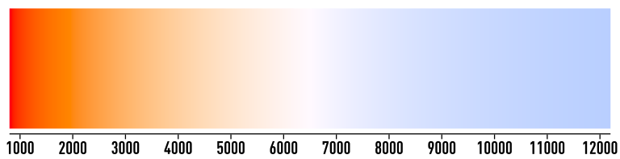

人眼通过视网膜上的视锥细胞（S、M、L，对应峰值响应波长蓝、绿、红）和视杆细胞（Rod）感知光线。人眼有局部适应性，一个颜色缓慢轻微调暗并不一定能察觉；Weber 定律表明，\\(\frac{\Delta I}{I} \approx \text{Const.}\\)（1% – 2% 在明视觉下），即变化的感知阈值与背景相关。此外还有亮度适应与色度适应（色恒常性），前者指视杆细胞和视锥细胞会动态调整敏感度，暗处时视杆细胞主导，明处时视锥细胞主导；后者指视锥细胞对特定波长光的敏感性随时间减弱，大脑会自动校正颜色感知，如走到略昏黄的房间里一会后可能会将照得略黄的墙壁认作白色，或长时间看红色东西后转向白墙会看到青色的补色块。

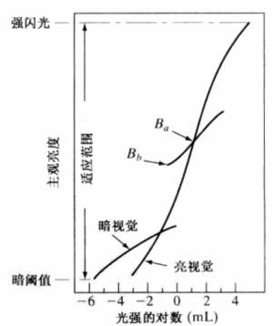

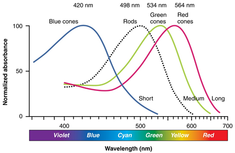

对于光亮度感知，显然看起来不可能（同功率下）各个波长都一样。因此我们实验测定了明视觉亮度函数（视效函数）\\(V(\lambda)\\)，在 \\(2\degree\\)视角、明视觉条件下平均人眼匹配不同波长光的明暗感觉得到。这个函数在约 555nm 处取到最大视效 \\(V_m = V(555\text{ nm}) = 683 \text{ lm/W}\\)（故人眼对绿光最敏感）；如果我们除以 \\(V_m\\)，将该点置一就得到我们常用的视见函数，仍记作 \\(V(\lambda)\\)（自然可见是否带这个常数因子不重要，后面自行知道即可）。（暗视觉 \\(V'_m = V'(507\text{ nm}) = 1700 \text{ lm/W}\\)）

因此我们讲到光的“强度”时本质上存在两套单位系统，物理的和人感知的（radiometric - photometric）。

| 能量      | 光量       |
| --------- | ---------- |
| J         | lm·s       |
| W         | lm         |
| W/sr      | cd         |
| W/(sr·m²) | cd/m², nit |
| W/m²      | lx         |

关于强度还要提的是 Gamma 校正。我们对信号施加非线性变换 \\(V_{out} = V_{in}^{\gamma}\\)。Weber 定律表示，如果我们不矫正，数位或者带宽的利用是不均的，人眼的 \\(\gamma\approx 0.45\\)，因此早期 CRT（阴极射线管）显示器设计时实际亮度 \\(L_{CRT}\sim V_{CRT}^{\gamma_{CRT}}, \gamma_{CRT} = \frac{1}{\gamma}\approx 2.2\\)。尽管现在使用的 LCD、OLED 等为非 CRT 显示器，内部仍然做了伪 Gamma 仿真，兼容使用近似 \\(\gamma = 1/2.4\\) 幂函数的 sRGB（实为分段函数）的 JPEG、PNG 等图像。

对于更常见的混合光，我们用 SPD（光谱功率分布，Spectral Power Distribution）\\(\Phi(\lambda)\\) 记录其不同 \\(\lambda\\) 的成分。光通量则可由积分 \\(\int \Phi(\lambda) V(\lambda) d\lambda\\) 得到。

注意上式有个隐含的假定，实际上可以推的更广，就是 Grassmann 定律：色彩知觉具有线性性，同样的颜色感知可以通过多个光谱的线性组合得到。换句话说，如果两束光在 RGB 下分别是 \\((R_1,G_1,B_1)',(R_2,G_2,B_2)'\\)，那么他们混合的颜色便为 \\((R_1+R_2,G_1+G_2,B_1+B_2)'\\)。这直接保证了颜色空间是线性空间，因此我们才可以用函数空间内积的方式定义在基色上的坐标 \\(R = \int \Phi(\lambda) \bar{r}(\lambda) d\lambda\\)，其中基函数 \\(\bar{r}(\lambda)\\) 记录 \\(\lambda\\) 光对某基色所分配的色度系数。以及注意 Weber 定律反映的是人高层感知上的非线性，Grassmann 仅描述色匹配上线性组合的底层等价性。

尽管 SPD 的函数空间很大，但我们的视觉只能得到里面三个维度（与三种视锥细胞的响应做内积），这奠定了主流色彩模型是三通道。考虑到部分人可能存在认识的误区，需要指出同样的频谱分布但是光强度不同（SPD 乘一常数倍）的话，是不同的颜色（回想一下自己看晴朗正午时的树叶和阴天傍晚的树叶）。因此很多模型会选择亮度这一维度，而剩下两维便是色度，在 HSV 空间里我们可以很清晰的理解这一点。（有些时候色度被视作饱和度的同义词，有时候颜色甚至指色度，但本文将避免。）

RGB 空间是我们最熟悉的，分别代理了人眼对三原色的响应。下面这个色环较常用：

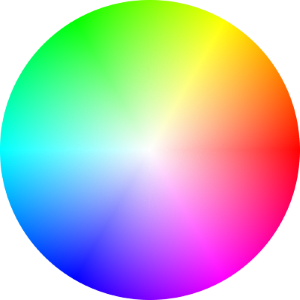

\\(0\degree, 120\degree, 240\degree\\) 为 R、G、B 三个方向，对应的补色 \\(60\degree, 180\degree, 300\degree\\) 分别为 Y（黄色 Yellow）、C（青色 Cyan）、M（Magenta 品红）。印刷普遍使用的 CMYK 模型便是如此，K（Key）为黑色；鉴于其他三色混不出完全的黑且黑色文字较彩图格外多，所以还要使用 K。为什么用 CMYK？注意到  RGB 作为加色模型，适合显示屏通过直接调整三色灯的值发光；而印刷的油墨应吸收各自对应的原色来叠加，即减色模型。转换的步骤如下：如果 RGB 是 \\([0,255]\\) 先归一化到 \\([0,1]\\)，而后 \\(C_0 = 1- R, M_0 = 1- G, Y_0 = 1-B\\)，\\(K=\min\\{C_0,G_0,Y_0\\}\\)，再缩放 \\(C=\frac{C_0-K}{1-K},G=\frac{G_0-K}{1-K},Y=\frac{Y_0-K}{1-K}\\)（\\(K=1\\) 则 \\(C=M=Y=0\\)）。

HSV 模型三个坐标分别表示色相/色调（Hue）、饱和度（Saturation）、明度/对比度（Value）。从下面的锥体可以马上理解它的表达方式，每个圆截面都类似一个色环，中轴没有颜色，由黑到白，色环的颜色也逐步变亮。公式为 \\(V=\max\\{R,G,B\\},S=1-\frac{\min\\{R,G,B\\}}{V}\\)（\\(R=G=B\\) 时 \\(S=0\\)），\\(H\\) 则用色环上的向量加法反推角度，可自行查阅。

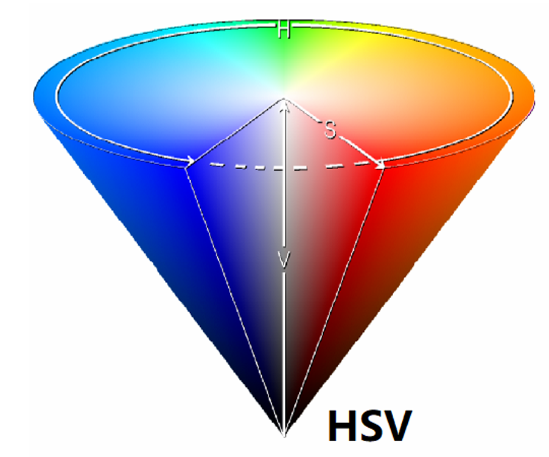

注意这里 V 和前面所讲的亮度并不相等；同样还有 HSI、HSL 模型，（Intensity）\\(I=\frac{R+G+B}{3}\\)，或 （Lightness）\\(L=\frac{\max\\{R,G,B\\}+\min\\{R,G,B\\}}{2}\\)；\\(S\\) 的分母也相应改动。

> 除此之外，视频常用 YUV 格式，介绍可以参见文末的小题目里。

空间是绝对的（由混合光的 SPD 决定每个点），我们对色的定义是相对的。（虽然没人也没必要把大家看着红红的东西重命名为蓝。）你可以指着我看着有点米黄的颜色表示这才是纯白，这样子我们对红绿蓝混成白的红到底需要有多红可能存在分歧，关于同一种光的三色坐标自然也不一样，甚至我们所能表达的空间也不尽相同。

上面提及的一个问题是基色到底怎么定义（红色应该多红；波长定了强度也要定）？严格的颜色模型需要定义白点基准，白点就是基色各一单位混合而成的颜色，如 \\(R=255,G=255,B=255\\)，它到底该是什么颜色决定了各基色的强度。在相机或 Photoshop 里修改白点也被叫做白平衡，常调动 a-b 轴（红 - 蓝轴）和 g-m 轴（绿 - 品红轴），前者（不绝对）\\(R=R_0(1-\delta),B=B_0(1+\delta)\\) 移动色温（常因背景白光打光变化），后者弥补 R 和 B 整体上产生的偏移。

> 为什么选白色作参考？大概因为其不含色度，对偏色更敏感。
>
> 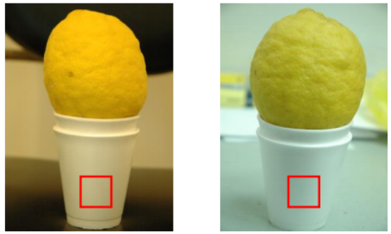
>
> 现在的白平衡算法很多，可以参考图像处理的相关资料。最简单的有完美反射（White Patch），假设图中最亮区域为白色，对 \\(R\\) 通道乘以增益 \\(k_R = \frac{\max\\{R,G,B\\}}{R_{\max}}\\)，其余同理；灰度世界（Grey World），假设整幅图的三通道平均值趋于相等，\\(\text{gray} = \frac{R_{\text{avg}}+G_{\text{avg}}+B_{\text{avg}}}{3}, k_R = \frac{\text{gray}}{R_{\text{avg}}}\\)，其余同理。

### Chromaticity

我们想要找到一种方式彻底解决任何颜色的表示问题。前面说的 RGB 并没有清楚的解决，因为我们没有指出各个波长、各种混合光分布在哪里坐标多少（甚至还没指出基色），无论如何进行实验是必要的。

需要的是颜色匹配实验。\\(\lambda\\) 光到底是什么颜色，我们希望看它由多少量的各基色光构成（至少人眼分不出来为止）。历史：20 世纪 20 年代末，W. D. Wright 和 J. Guild 各做过一次颜色匹配实验；两次实验均独立进行，但结果却惊人的一致。Guild 合并了两个实验的数据，并做了一系列数据增强操作（插值和平滑等），由此产生的色度数据构成了 CIE（国际照明委员会）1931 的一系列决议。

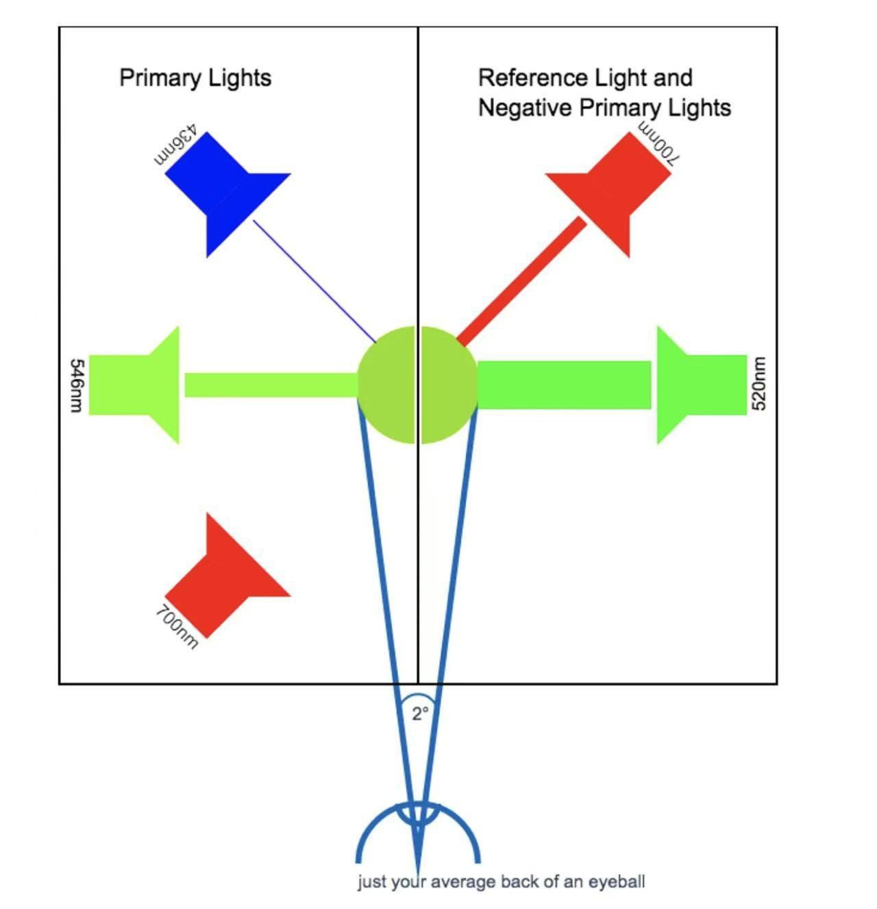

上图反映了所讲的颜色匹配的思想。简要概括一下流程：首先确定参考白光，当时使用 NPL（英国国家实验室）的标准白光，它应该由各一个单位的基色组成，我们先匹配它；由此可定义基色单位，注意我们后面只需要得到光圈孔径角的比值即可。接下来用测试光匹配三基色，记录它们的光圈读数；测试光的绝对数量不重要。转换到单位并归一就得到了该测试光的色度系数。

最终得到了光谱色度系数 \\(r(\lambda),g(\lambda),b(\lambda)\\)（且 \\(r(\lambda)+g(\lambda)+b(\lambda)=1\\)），Wright 的曲线原稿见图。

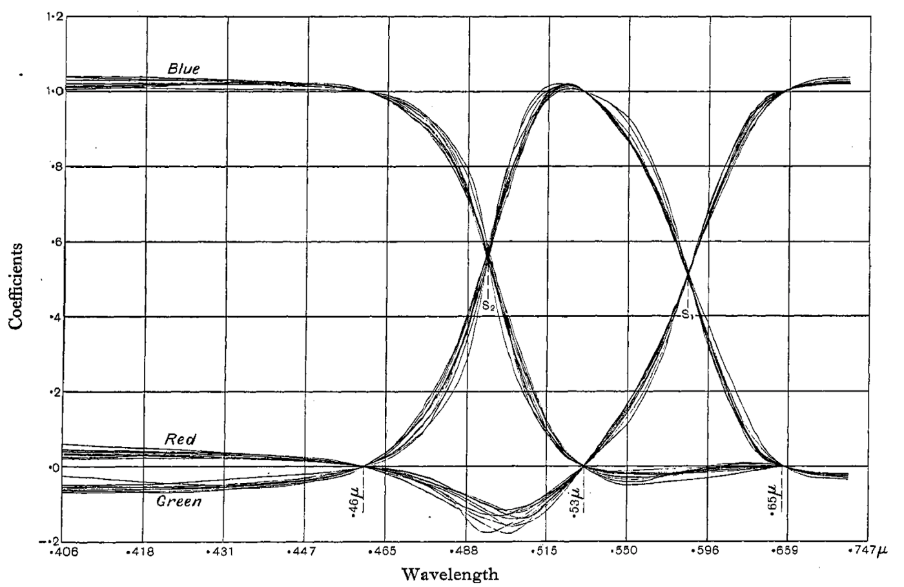

注意负数是因为我们发现有些颜色光靠相加无法匹配，故在测试光这一侧添加一定基色光以进行匹配，移项后记负值。

> 事实上，WG 二人原始使用的基色均不为 NPL 标准基色（\\(\lambda_r\\) = 700 nm 的红光，\\(\lambda_g\\) = 546.1nm 的绿光，\\(\lambda_b\\) = 435.8 nm 的蓝光，他们通过一点合成变换的方式让实验近似为 NPL 标准基色做的那样（感兴趣可参考 [1-3]）。
>
> 为什么选这三个做标准基色？\\(\lambda_g\\) 和 \\(\lambda_b\\) 是汞灯谱线，易于生产；人眼在 700 nm 附近一定范围内不敏感，误差较小。

之后还有一件事要讨论，就是 scale/标准化。后面 CIE 1931 使用了 EEW（Euqal-Energy White 等能量白光/理想白光）作为参考白光，它的 SPD 在各波长取常值。那么我们需要做个尺度变换来调整白点。首先引入我们的颜色匹配函数 CMF（Color Matching Functions）：

\\(\bar{r}(\lambda)=U(\lambda)r(\lambda),\ \bar{g}(\lambda)=U(\lambda)g(\lambda),\ \bar{b}(\lambda)=U(\lambda)b(\lambda)\\)

其中 \\(U(\lambda)=\frac{V(\lambda)}{L^r r(\lambda)+L^g g(\lambda)+L^b b(\lambda)}\\)，\\(L^r, L^g, L^b\\) 为三个基色光的单位亮度。可以发现颜色匹配函数的值定义为匹配一单位 \\(\lambda\\) 波长的光的亮度需要多少单位的 r/g/b 基色光。相较于最开始的比例（色度系数）\\(r = \frac{\bar{r}}{\bar{r}+\bar{g}+\bar{b}}\\)，这里把总份额重新算进来了。

利用 Grassmann 定律我们知道任何混合光的坐标（匹配量）\\(R = \int \Phi(\lambda)\bar{r}(\lambda)d\lambda,\ G = \int \Phi(\lambda)\bar{g}(\lambda)d\lambda,\ B = \int \Phi(\lambda)\bar{b}(\lambda)d\lambda\\)。

scale 希望调整 \\(L^r \rightarrow W_rL^r,\ L^g \rightarrow W_gL^g,\ L^b \rightarrow W_bL^b\\)，使得新基色光混成 EEW。理解上根据 \\(\bar{r}\\) 的定义，如果单位的亮度扩大了 \\(W_r\\) 倍，那么 \\(\bar{r}\\) 应缩小 \\(W_r\\) 倍，即
$$
\bar{r}' = \frac{\bar{r}}{W_r} = \frac{V(\lambda)\frac{r(\lambda)}{W_r}}{W_rL^r \frac{r(\lambda)}{W_r}+W_gL^g \frac{g(\lambda)}{W_g}+W_bL^b \frac{b(\lambda)}{W_b}} = \frac{V(\lambda)r'(\lambda)}{L^{r\prime} r'(\lambda)+L^{g\prime} g'(\lambda)+L^{b\prime} b'(\lambda)}
$$
中间的式子直接告诉我们 scale 色度系数的方法：\\(r'(\lambda)=\frac{\frac{r(\lambda)}{W_r}}{\frac{r(\lambda)}{W_r}+\frac{g(\lambda)}{W_g}+\frac{b(\lambda)}{W_b}}\\)，其余同理；本质就添了归一化的分母。EEW 的定义等价于 \\(\int \bar{r}'(\lambda)d\lambda = \int \bar{g}'(\lambda)d\lambda = \int \bar{b}'(\lambda)d\lambda\\)，所以匹配函数下方面积的标准化即为理想参考白点的变换。代入这个面积相等方程，或者直接理解便知道 \\(W_r,W_g,W_b\\) 应取 EEW 在旧基色光单位下的分量（只需要三者的比）。如此 scale 后得到的 CMF 即为 CIE 1931 RGB CMF。

Guild 的实验里他测算的 NPL 标准基色的亮度系数 \\(L^r_0:L^g_0:L^b_0 = 1:4.404:0.047\\)，转换后 \\(L^r:L^g:L^b = 1:4.591:0.060\\)；下图为 EEW scale 过的色度系数曲线和 CMF 曲线。

> 实际上 Guild 1931 年论文 [3] 里的值是 \\(L^r_0:L^g_0:L^b_0 = 1:4.410:0.052\\)。Broadbent [5] 发现 WG 当时犯了错，500nm 附近存在明显偏差（可能是数据处理技巧的错误），后来他们应该在 CIE 1931 时又订正了但并未公开发表，Broadent 通过逆向工程完整重建了包括平滑、插值、拟合、变换在内的处理过程。

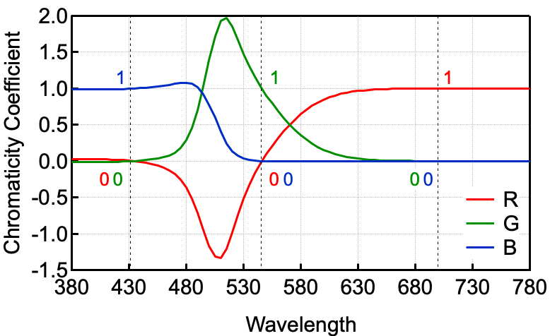

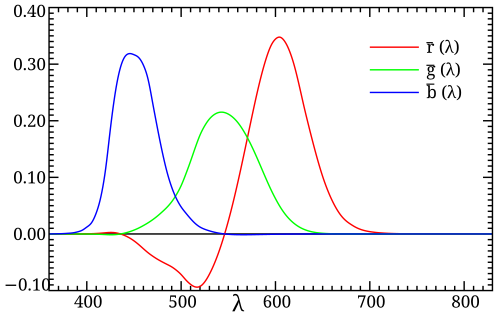

因此我们想测出 Normalized CMF 描述的系数需要设置 rgb 源亮度比 \\(1:4.591:0.060\\)，这也等价于设置源功率比 \\(\frac{L^r}{V(\lambda_r)}:\frac{L^g}{V(\lambda_g)}:\frac{L^b}{V(\lambda_b)} = 72.096 : 1.379 : 1\\)。

> 这就解释了 Wiki 里 CIE 1931 color space 词条中莫名其妙冒出的一句 "... the resulting normalized color matching functions are then scaled in the r:g:b ratio of 1:4.5907:0.0601 for source luminance and 72.0962:1.3791:1 for source radiance to reproduce the true color matching functions." 
>
> 但 then scaled 和 reproduce true CMF 表意不明，scale CMF and chromaticity functions 的方法我们讲过了，复现的就是这一个 CMF，normalized 就已经 scaled，更不知道 true 和 false CMF 指什么。

小问题：能根据上段得出 \\({\bar{r}(\lambda_r)}:{\bar{g}(\lambda_g)}:{\bar{b}(\lambda_b)}\\) 吗？

> 答案：将前式 \\(72.096 : 1.379 : 1\\) 取倒数得到 \\(0.0041:0.215:0.291\\)（可自行查表验证）。回顾一下定义，我们其实已经回答了（第一眼看上去会问的）为什么各 CMF 在其基色波长处不等于 1。

\\(\bar{r},\bar{g},\bar{b}\\) 的定义里也可以乘以一常数倍（只在整体缩放三个基向量 \\(\hat{R},\hat{G},\hat{B}\\) 而已），如 \\(L^r+L^g+L^b\\)，因为我们常取 \\(\int \bar{r}(\lambda)d\lambda = \int \bar{g}(\lambda)d\lambda = \int \bar{b}(\lambda)d\lambda = \int V(\lambda)d\lambda\\)。这是有道理的，乘上之后类似标准化除去了基色亮度的单位，只受 V 的单位影响。第二个好处是此时有 \\(\frac{L^r}{L^r+L^g+L^b}\bar{r}(\lambda)+\frac{L^g}{L^r+L^g+L^b}\bar{g}(\lambda)+\frac{L^b}{L^r+L^g+L^b}\bar{b}(\lambda)=V(\lambda)\\)，系数归一，也相当于在亮度上 scale 到了一起。

注意到 \\(L^r \bar{r}+L^g\bar{g}+L^b\bar{b} \propto V\\)，\\(L^r:L^g:L^b\\) 历史上 CIE 真正的做法便是最小二乘把三条 CMF 向 \\(V(\lambda)\\) 拟合得到。

> Yuhao Zhu 的博文在这一部分（最后一节）对 Fairman 论文 [4] 的解读出错（此外在论文考古方面也有事实错误）。如果要拟合，总得有以 EEW 为白点的 \\(\bar{r},\bar{g},\bar{b}\\)，无论是直接测定还是先测定 \\(r,g,b\\)，不可能一开始基色就匹配理想白点（是的话更不需要算了），那么一定要经过 scale 的过程，按他的逻辑这就循环了。所以拟合只是后来者节省精力和误差，而不是本质性的基色光亮度的获取方法。
>
> 并且该节指鹿为马，写的明明是解面积相等方程的内容。即便解方程，如果硬用没有 scale 的 \\(r,g,b\\)，列出 \\(\int \frac{V(\lambda)r(\lambda)}{L^r r(\lambda)+L^g g(\lambda)+L^b b(\lambda)}d\lambda = \int \frac{V(\lambda)g(\lambda)}{L^r r(\lambda)+L^g g(\lambda)+L^b b(\lambda)}d\lambda = \int \frac{V(\lambda)b(\lambda)}{L^r r(\lambda)+L^g g(\lambda)+L^b b(\lambda)}d\lambda\\)，这个解出来的 L 缺乏意义，因为 \\(r,g,b\\) 根本不是在这一套 L 下测定的。

> 总之上述流程的 scale 或者白点变换一定要做，至于是在 WG 手上已经做了还是 CIE-XYZ 时候做的并不重要，事实我倾向于这是同一件事：Guild 的那篇文章和实验结果于 1931 年才发表，提出 XYZ 方案的 CIE 1931 会议里 Guild 本来就是核心人物。

接下来我们取 \\(r=\frac{R}{R+G+B},g=\frac{G}{R+G+B},b=\frac{B}{R+G+B}=1-r-g\\)。对于色度/色品图，我们不关心亮度，因此取占比的坐标是合理的（或者说所以才叫色度图）。

> 当然，\\(r \neq \int \Phi(\lambda)r(\lambda)d\lambda\\)，里面被调整了一个 \\(\frac{U(\lambda)}{\int \Phi(\lambda)U(\lambda)d\lambda}\\)。

下图的蓝线为光谱轨迹（spectrum locus），反映了 380nm - 780nm 各单色光的 rgb 坐标，我们将其投影到 rg 平面得到 rg 色度图。

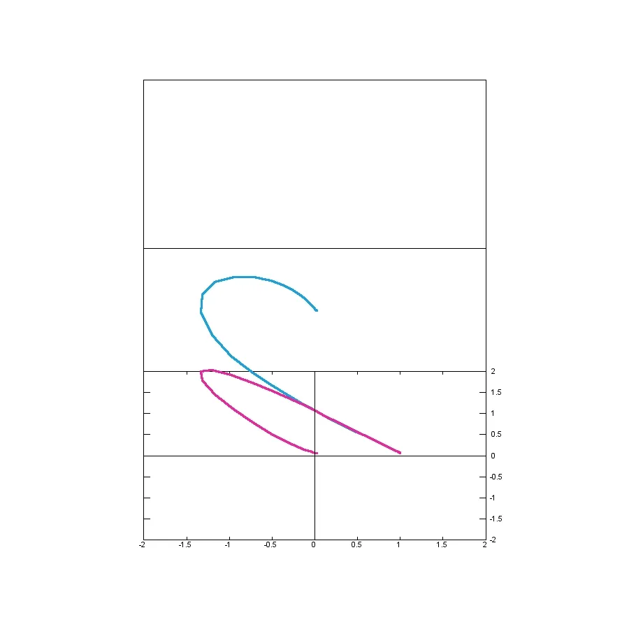

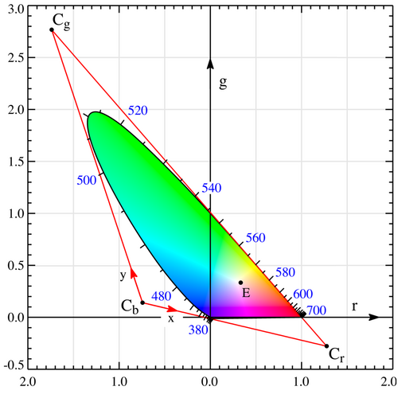

注意到有相当一部分区域 \\(r\\) 取负值；色域的下沿刚好位于 r 轴上，这正是 \\(\bar{g}(\lambda)\\) 几乎始终大于 0 的结果。同时图中呈现一个马蹄形，这也告诉我们想用类似 RGB \\([0,1]\\) 表示全部可见颜色是没戏的（其颜色空间只为内部的一个三角形）；鉴于任意两个可见颜色的凸组合一定也可见，因此人的色域一定为凸集。光谱轨迹通过 \\((r,g)=(0,0)\\) 于 \\(\lambda_b\\) 435.8 nm，\\((0,1)\\) 于 \\(\lambda_g\\) 546.1 nm，\\((1,0)\\) 于 \\(\lambda_r\\) 700 nm；且均等能量点 EEW 位于 \\((\frac{1}{3},\frac{1}{3})\\)。（380nm - 435.8nm 区间 \\(r\\) 和 \\(g\\) 基本无响应，故聚集在原点上。）

现在我们希望变换一个坐标架，克服负值等数值规格上的缺点；即设计新的三个基函数 \\(\bar{x},\bar{y},\bar{z}\\)，\\(\begin{bmatrix} \bar{x}(\lambda) \\  \bar{y}(\lambda) \\  \bar{z}(\lambda)  \end{bmatrix} = M \cdot  \begin{bmatrix} \bar{r}(\lambda) \\  \bar{g}(\lambda) \\  \bar{b}(\lambda)  \end{bmatrix}\\)，则 \\(\begin{bmatrix} X \\  Y \\  Z  \end{bmatrix} = M \cdot  \begin{bmatrix} R \\  G \\  B  \end{bmatrix}\\)，使得具有如下性质：（同样取 \\(x=\frac{X}{X+Y+Z},y=\frac{Y}{X+Y+Z},z=1-x-y\\)，上图中 \\(C_r,C_g,C_b\\) 分别记 \\(\hat{x},\hat{y},\hat{z}\\)）

- 色域完全包含于 \\(\hat{x}(1,0),\hat{y}(0,1),\hat{z}(0,0)\\) 围成的三角形里。
- \\(Y\\) 表示亮度，即 \\(\bar{y}(\lambda)=V(\lambda)\\)。
- EEW 位于 \\(x=y=z=\frac{1}{3}\\)。
- 设置 \\(\bar{z}(650\text{ nm})=0\\)，即 \\(\hat{x}, \hat{y}\\) 连线在此处相切。

> 上面的罗列概括自 Wiki。关于最后一条，Judd 注意到当时有机会设置 \\(\bar{z}\\) 函数的长波段尾部全为 0，因为 \\(\hat{g}, \hat{r}\\) 连线几乎完全贴合了光谱轨迹，尤其 620 nm - 680 nm。但实际上蓝光在这一段有轻微的负值，故其实是凸出 \\(-45\degree\\)直线外的。不过前面提到过人红端分辨率很低，这一节省工作量的替代方法带来的误差不大。
>
> 关于 CIE 1931 决议的记载和 Fairman [4] 并未直接表示这一条件，只是说 \\(-\frac{100}{99}\\) 斜率足以在要求的精度下包围光谱轨迹；同时鉴于精度有限（\\(\bar{b}\\) 的单数字位被舍入误差严重影响）使得 \\(\bar{z} = 0\\) 在一个可考的红波长范围内，这就够了。650 nm 相切的框架可能是后人根据当时（没有计算机）选择的斜率重新确定的结果。

首先我们根据等亮度画出表示 \\(\bar{y}(\lambda)=\text{Const.}\\) 的直线（线性性），其中经过原点的线亮度几乎为 0，称作 alychne（ἄλυχνος，means "no light" and is coined by Schrodinger）。我们前面已经强调过 \\(V = L^r \bar{r}+L^g\bar{g}+L^b\bar{b}\\)（或放缩一个倍数，把尺寸放入 CMF 中）和拟合的方式；准确来讲，alychne 不经过 \\((r,g)=(0,0)\\)，其定义的 \\(Y=0\\) 线为 \\(0=0.177 r + 0.812 g + 0.011 b\\)（即系数 \\(L^r,L^g,L^b\\) 归一），代入 \\(b = 1-r-g\\) 即 \\(0.166r + 0.802g + 0.011 = 0\\) 为连接 \\(\hat{x},\hat{z}\\) 的边。选择亮度方程为 \\(\hat{Y}\\) 基色后另两个基色 \\(\hat{X},\hat{Z}\\) 必然在这条线上（故不含亮度）。

注意直线直接确定了新匹配函数或其乘以一常数。接着再由切线的条件确定第二条边 \\(\hat{x},\hat{y}\\)。如果第三条边确定，那么三个交点也随之确定，且均在色域外，完全为数学虚拟。注意 rg 色度图是和为 1 的斜面向 rg 平面的投影，三个基色当然不能线性相关。并且此时自由度并未完全耗尽，直线确定的基函数还各有一个自由度，而亮度 Y 由于直接被定死，系数将直接调节 X 和 Z 满足白点条件即面积相等，从而确定三基色。那么我们（尚有两个自由度）选择第三条边 YZ 尽量接近光谱轨迹，在 r 负值极限 505 nm 附近贴近，不过实际并未切上，留有小的误差空间。（具体选择了 alychne 上 \\(r = -0.743\\) 的点和 \\(\hat{x},\hat{y}\\) 连线上 \\(r = -1.74\\) 的点为交点。）

> 从矩阵角度来看，9 个未知元，第二行 Y 首先被固定，其次使用 EEW 标准化，则 \\(M_{11}+M_{12}+M_{13}=M_{31}+M_{32}+M_{33}=1\\)，还剩 4 个自由度。650 nm 相切的条件（包含一个零阶和一阶条件）再用掉 2 个。

最终得到的变换矩阵为 \\(M =  \begin{bmatrix} 0.49000 & 0.31000 & 0.20000 \\\ 0.17697 & 0.81240 & 0.01063 \\\ 0.00000 & 0.01000 & 0.99000 \\\ \end{bmatrix}\\)。我们既可以用 \\((X,Y,Z)\\) 也可以用 \\((x,y,Y)\\) 等其他常见的坐标系；注意下面是 xy 图，一般默认第三坐标是亮度 Y。把黑体辐射轨迹（Planckian locus）按公式计算后画出来便如图所示，在色度图中从红经过白再到蓝，但不会到达 alychne。

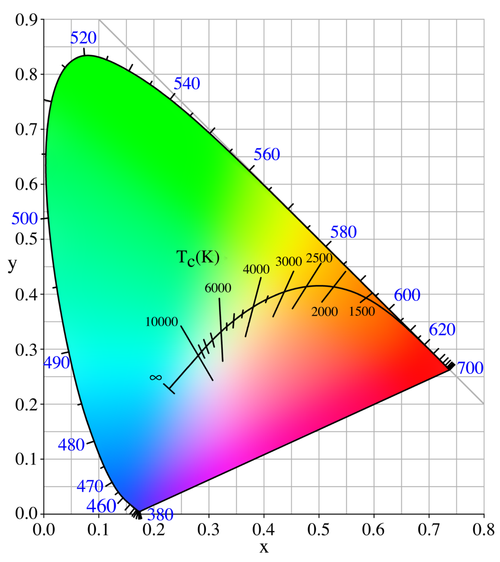

小问题：把若干色度坐标为 \\((x_i,y_i)\\)，亮度为 \\(L_i\\) 的光（\\(i=1,\dots,n\\)）混合得到的光色度坐标为？

> 答案：\\(x_{\text{mix}} = \frac{\frac{x_{1}}{y_{1}} L_{1} + \frac{x_{2}}{y_{2}} L_{2} + \cdots + \frac{x_{n}}{y_{n}} L_{n}}{\frac{L_{1}}{y_{1}} + \frac{L_{2}}{y_{2}} + \cdots + \frac{L_{n}}{y_{n}}},\  y_{\text{mix}} = \frac{L_{1} + L_{2} + \cdots + L_{n}}{\frac{L_{1}}{y_{1}} + \frac{L_{2}}{y_{2}} + \cdots + \frac{L_{n}}{y_{n}}}\\)。

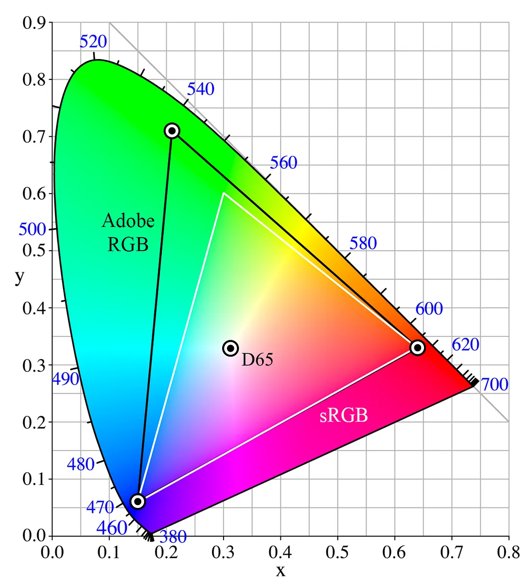

可以看到各个颜色围绕 EEW 的排布与常见的色环基本一致。对于现实中的各类色彩模型（如计算机使用的 standard RGB)，严格定义需要给出原色色度坐标 \\((x_R,y_R),(x_G,y_G),(x_B,y_B)\\)、白点 \\((x_W,y_W)\\)（如 sRGB 为 D65，模拟日光，名字来源于其色温 6500K）、Gamma 曲线，以及色域映射（Gamut mapping，将超出色彩空间的颜色映射进来，有 clip, compression 等方式）等（可见于 .icc 配置文件）。

> CIE-LAB/CIE L\*a\*b* 解决了 XYZ 刻画颜色差异的弱点，在其基础上借鉴 MacAdam 椭圆的颜色差异度量，使相同欧式距离有相同的 MacAdam 色差（感知均匀，但并未完全消除扭曲问题）。比如左上方的绿区，标准差椭圆（实验通过观察者将别的颜色调制到认为与测试光相同测定）较大，人眼等距离的分辨力不强，而左下的蓝区椭圆则较小。LCh 是其圆柱表示版。
>
> L* 表示亮度，a* 轴反映绿色 - 红色，b* 轴反映蓝色 - 黄色；它对 XYZ 进行了非线性变换，具体公式可自行查阅 Wiki。

### Simple Questions

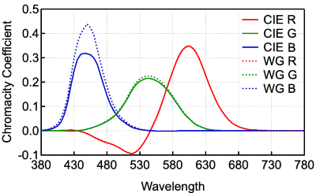

**1.** 上图为 CIE 与 Wright-Guild 测定的颜色匹配函数，WG 使用了 NPL 标准白光作为参考白点，设该白色在 CIE-xyY 下前两个坐标为 \\((x,y)\\)，则其应该符合哪个关系？

A. \\(x > \frac{1}{3},\ y > \frac{1}{3}\\) B. \\(x < \frac{1}{3},\ y < \frac{1}{3}\\) C. \\(x < \frac{1}{3},\ y > \frac{1}{3}\\)

**2.** 人们常使用 YUV 色彩格式（常见于电视和流媒体的视频编码中，YCbCr/YCC 为其数字版），下面是 BT.709 标准（HDTV、Youtube 等）规定的与 sRGB 的转换公式：
$$
Y = 0.213 R + 0.715 G + 0.072 B,\ U = \frac{B-Y}{1.856},\ V = \frac{R-Y}{1.575}
$$
亦即
$$
\begin{bmatrix} R \\\ G \\\ B \end{bmatrix} = \begin{bmatrix} 1 & 0 & 1.575 \\\ 1 & -0.187 & -0.468 \\\ 1 & 1.856 & 0 \end{bmatrix} \begin{bmatrix} Y \\\ U \\\ V \end{bmatrix},\ \begin{bmatrix} Y \\\ U \\\ V \end{bmatrix} = \begin{bmatrix} 0.213 & 0.715 & 0.072 \\\ -0.115 & -0.385 & 0.5 \\\ 0.5 & -0.454 & -0.046 \end{bmatrix} \begin{bmatrix} R \\\ G \\\ B \end{bmatrix}
$$

其中 \\(Y\\) 同 CIE-XYZ 一样被设计为亮度，\\(U\\) 和 \\(V\\) 分别为蓝差与红差。关于 YUV 和 XYZ 两个模型在 \\(Y\\) 方向上的基向量 \\(\hat{Y}\\)，下面哪句是正确的？

A. 两个 \\(\hat{Y}\\) 相同，且均不可见，但仅 YUV 的 \\(\hat{Y}\\) 现实中存在

B. 两个 \\(\hat{Y}\\) 不同，YUV 的可见，XYZ 的不可见，但两者的 \\(\hat{Y}\\) 现实中均存在

C. 两个 \\(\hat{Y}\\) 不同，YUV 的可见，XYZ 的不可见，但仅 YUV 的 \\(\hat{Y}\\) 现实中存在

**3.** 一个因绿视锥细胞部分缺陷而有红绿色盲症状的人，之前在户外拍摄，当走到白炽灯照明的室内环境后，相机所调整的白平衡会有什么问题？

A. 照片偏冷青 B. 照片偏暗红 C. 照片偏暖黄

**4.** 鸟类较人多一种视锥细胞（UV 紫外某波段为其响应峰值），现在我们打算制作给鸟看的海报，下面哪句是正确的？

A. 印刷时仍可以使用 CMYK，只要再补充一种其他吸收性质的油墨

B. 鸟类色域画在 CIE 色度图里会是一个包含人类色域的更大的凸形，且白点几乎重合

C. 图像设计时仍需对 UV 通道另外进行 Gamma 校正

### Answers

1.A 2.C 3.A 4.C

解答：

1：参考白点是各一单位基色的混合，由于 WG 的 \\(\bar{b}(\lambda)\\) 较 CIE 的高许多，则 WG 白光的 SPD 曲线应该在蓝光段偏低，亦即偏其补色黄色，故位于理想白的右上方。事实上我们在正文里讲到标准化时故意没有给出 EEW 白光在旧系下分量 \\(W_r,W_g,W_b\\) 的具体数值（等于新旧基色光亮度比值，前文数据可验证），现在可以给出来 \\(W_r:W_g:W_b = 0.301:0.314:0.385\\)。可以看到蓝光需要扩大的最多。

2：包含三个问题：Y 的基向量相等（基色相同）吗？不是的，因为另外两个维度差别挺大。注意存在不同的坐标架但是某方向的分量值一直相等。U 和 V 的基向量均无 CIE-Y 分量（当然，说明它们不可见），故 YUV 的 \\(\hat{Y}\\) 应直接穿过 EEW 的三等分点。YUV 的 \\(\hat{Y}\\) 可见吗？它是 RGB 基色的凸组合，一定可见。XYZ 的 \\(\hat{Y}\\) 已经说过，来自数学虚拟。现实存在吗？当然不可能存在，XYZ 是建立在人感知上的，谁知道那个超绿色的点是什么东西，自然造不出来。顺带一提，从变换式来说 YUV 的单纯形和 sRGB 的单纯形相互交叉，但显然 YUV 的后两坐标会允许负值，故仍与显示器所用的 RGB 保持转换关系（但是 Gamma 不同，YUV 看起来要暗一点）。下图 W、B-W、R-W 分别代表 Y、U、V。

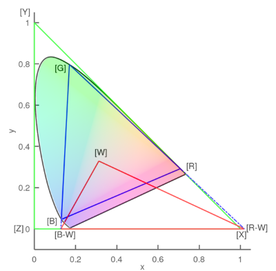

3：色温降低，白点黄移，而由于绿色感知的缺陷，摄像者会看到过度的偏红，因此 ab 轴会过度蓝移，同时 gm 轴也可能会补偿不足，残留绿色，故照片偏青和冷色调。

4：A 选项：CMYK 没有明确它们对紫外频道的吸收性，直接使用该减色模型会出现错乱。B 选项：鸟的色域画不在人的颜色空间里（低一维的狗倒可以），即便是截面，也无法确定依赖人视觉的坐标。并且在更大的波段考虑，人的白点远超鸟类。C 选项：这是显然的。鸟的视细胞也服从刺激的 Weber 定律，但不一定数值与人相同。我们需要对 RGB 再次进行补偿校正，同时紫外新通道也需要按鸟类的 Gamma 做矫正。

### Acknowledgements & Further Reading

Papers：

> [1] Wright W D. A re-determination of the trichromatic coefficients of the spectral colours[J]. Transactions of the Optical Society, 1929, 30(4): 141.
>
> [2] Wright W D. A re-determination of the mixture curves of the spectrum[J]. Transactions of the Optical Society, 1930, 31(4): 201.
>
> **[3]** Guild J. The colorimetric properties of the spectrum[J]. Philosophical Transactions of the Royal Society of London. Series A, Containing Papers of a Mathematical or Physical Character, 1931, 230(681-693): 149-187.
>
> **[4]** Fairman H S, Brill M H, Hemmendinger H. How the CIE 1931 color‐matching functions were derived from Wright‐Guild data[J]. Color Research & Application, 1997, 22(1): 11-23.
>
> **[5]** Broadbent A D. A critical review of the development of the CIE1931 RGB color‐matching functions[J]. Color Research & Application, 2004, 29(4): 267-272.
>
> [6] Broadbent A. Calculation from the original experimental data of the CIE 1931 RGB standard observer spectral chromaticity coordinates and color matching functions[J]. Québec, Canada: Département de génie chimique, Université de Sherbrooke, 2008: 1-17.

Books：

> **[7]** Akenine-Moller T, Haines E, Hoffman N. Real-time rendering[M]. AK Peters/crc Press, 2019.
>
> [8] Wright W D. The measurement of colour[J]. 1944.

Misc：

> [9] The Colour & Vision Research laboratory and database. http://www.cvrl.org/
>
> **[10]** How the CIE 1931 RGB Color Matching Functions Were Developed from the Initial Color Matching Experiments. Yuhao Zhu. 2020. https://yuhaozhu.com/blog/cmf.html
>
> **[11]** A Beginner’s Guide to (CIE) Colorimetry. Chandler Abraham. 2016. https://medium.com/hipster-color-science/a-beginners-guide-to-colorimetry-401f1830b65a

尽管我们希望彻底讲清逻辑，但是为了理解仍然会和历史有少许出入。如果对理论的构建过程有特别需求，建议阅读 [4]。

图片来自 [9-11], Wiki。