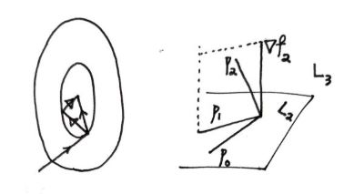


如果初始点的选择不好或者函数行为不好时，最速下降法可能并不理想。我们先从几何和直觉上展示共轭梯度法，同时可以在后文理清数学逻辑后再来看看这两张图。

对于精确线搜索，最速下降法的前后两步的下降方向必定是垂直的，从而导致了可能的 zigzag 现象。共轭梯度法所选择的共轭方向 \\(p_i\\) 更加具备全局性；例如图中的二次函数 \\(f=\frac{1}{2}x^\prime Ax-b^\prime x,\ \nabla f = Ax-b\\)，第二步的方向一定指向最优点 \\(Ax^\*=b\\)。右图可见共轭方向并不一定垂直，而是 \\(A\\) 意义下的垂直：\\(p_i^\prime Ap_j = 0,\ i\neq j\\)。注意到对于 \\(A\in \mathbb{S}\_+\\)，易证这一组 \\(\\{p_i\\}\_{i=1}^n\\) 线性独立，我们希望逐步获得 \\(x^\*\\) 在这组基上的表示。

---

我们先考虑线性版本（即上面的 \\(f\\)）。

$$
\dots \overset{p_{i-1}}{\longrightarrow} x_i \overset{p_{i}}{\longrightarrow} \dots
$$

假装我们能获取每一步的搜索方向 \\(p_i\\)，那么由精确线搜索知 \\(p_i \perp -\nabla f_{i+1}\\)，其中 \\(\nabla f_{i+1} := \nabla f(x_{i+1})\\)，且 \\(x_i = x_0 + \sum_{j=0}^{i-1}\alpha_j p_j\\)，\\(\alpha_i\\) 记步长。

同时我们可以直接得到一个关于搜索步长的表达式，对 \\(f(x_i + \alpha_i p_i) = g(\alpha_i),\ g^\prime (\alpha_i) = 0\\) 得到

$$
\alpha_i = -\frac{p_i^\prime \nabla f_i}{p_i^\prime Ap_i} = -\frac{p_i^\prime A x_0}{p_i^\prime Ap_i} \tag{1}
$$

第二个等号代入了 \\(x_i\\) 和 \\(\nabla f\\) 的表达式。接下来我们要确定这些 \\(p_i\\)。共轭梯度法告诉我们，以下两个条件在我们目前的 setting 下等价：

**Theorem** \\(\quad\\) The following two are equivalent:

$$
\begin{align}
\mathrm{(i)}& \quad p_i^\prime Ap_j = 0,\ i\neq j \tag{2} \\\
\mathrm{(ii)}& \quad x_i = \arg\min_{x\in L_i}f(x),\ L_i := \text{span}\\{p_0,\dots,p_{i-1}\\}+x_0 \tag{3}
\end{align}
$$

归纳证明，因此 \\(\mathrm{(i)}\\) 处可以修改为 \\(j<i\\)；初始位于 \\(x_0\\)，只有一个 \\(p_0\\)（很自然的，我们会先选择负梯度方向 \\(p_0 = b - Ax_0\\)），\\(\mathrm{(i)}\\) 自动成立，我们只需要选取恰当的 \\(\alpha_0\\) 则 \\(\mathrm{(ii)}\\) 也符合。之后我们将在 \\(0,\dots,i\\) 成立有 \\(\mathrm{(i)}\\) \\(\mathrm{(ii)}\\) 等价的情况下说明 \\(i+1\\) 的正确性。

\\(\mathrm{(i)}\rightarrow \mathrm{(ii)}\\)：我们需要说明，\\(\exists\ \alpha_i>0,\ \text{s.t. } x_{i+1} = x_i + \alpha_i p_i = \arg\min_{x\in L_{i+1}}f(x).\\) 其中 \\(L_{i+1} = \\{x\in \mathbb{R}^n|x = x_0 + \sum_{j=0}^{i}\gamma_j p_j, \gamma_j \in \mathbb{R}\\}.\\)（注意这里想说的核心是，当我们把视野从子空间 \\(L_i\\) 扩展到 \\(L_{i+1}\\) 时，原先方向上均无需调整。）

\\(g_j(\gamma_j):=f(x),\ g_j^\prime (\alpha_j)=0,\ j<i\\) 立刻得到一个结论

**Corollary 1**

$$
\nabla f_i^\prime p_j = 0,\ \forall j<i \tag{4}
$$

亦即 \\(\nabla f_i \perp (L_i - x_0)\\)；还有一个垂直的表现形式见下面。利用 \\(\mathrm{(i)}\\) 可以证明上式。

\\(\mathrm{(ii)}\rightarrow \mathrm{(i)}\\)：同上面基本一致，注意利用归纳的假设（\\(\leq i\\) 之内皆成立有 \\(\mathrm{(i)}\\)）\\(\Box\\)

从上面定理可以马上得出共轭梯度法（二次函数下）在 \\(n\\) 步之内必定达到最优。因为 \\(\mathrm{(i)}\\) 表明了 \\(p_i\\) 们线性无关，故 \\(L_n\\) 应为 \\(\mathbb{R}^n\\)，其上最小值点 \\(x_n = x^*\\)。

目前为止我们仍然没有给出明确的每步 \\(p_i\\) 的获取方式。我们采用一种非常自然的想法，考虑到我们想要最快的下降，处在每一步时走的新维度应该由 \\(\nabla f_i\\) 提供（但我们说了，直接沿 \\(\nabla f_i\\) 并不是最理想的方法；我们希望看长远一点，因为它缺乏类似定理 \\(\mathrm{(ii)}\\) 的各步最优的协调性）。因此 \\(p_i = -\nabla f_i + \sum_{j=0}^{i-1}\beta_j p_j\\) 看上去很合适，再对两边点乘 \\(p_j^\prime A\\) 即可得到各个 \\(\beta_j\\)；但我们希望更简洁一点，\\(p_i = -\nabla f_i + \beta_{i-1} p_{i-1}\\) 同样是可行的。此时得

$$
\beta_i = \frac{p_{i-1}^\prime  A \nabla f_i}{p_{i-1}^\prime Ap_{i-1}} \tag{5}
$$

在这一更新方式下，还可以发现

$$
\nabla f_i^\prime \nabla f_j = 0,\ \forall j<i \tag{3'}
$$

以及（利用 \\(p_0 = - \nabla f_0,\ \nabla f_i = \nabla f_0 + \sum_{j=0}^{i-1}\alpha_j A p_j.\\)）

**Corollary 2**

$$
\begin{align}
x_i \in L_i & =  \text{span}\\{p_0,p_1,\dots,p_{i-1}\\}+x_0 \\\ & = \text{span}\\{\nabla f_0,\nabla f_1,\dots,\nabla f_{i-1}\\}+x_0 \\\ & = \text{span}\\{\nabla f_0, A \nabla f_0,\dots,A^{i-1}\nabla f_0\\}+x_0
\end{align}
$$

同时还有（\\(\text{(4')}\\) 由 \\(\text{(4)}\\) 上下同乘 \\(\alpha_{i-1}\\)，可称 Fletcher–Reeves 式）

$$
\alpha_i = -\frac{\nabla f_i^\prime \nabla f_i}{p_i^\prime Ap_i} \tag{1'}
$$

$$
\beta_i = -\frac{\nabla f_i^\prime \nabla f_i}{\nabla f_{i-1}^\prime \nabla f_{i-1}} \tag{4'}
$$

到这里最开始的图景应该已经解释清楚了。总结成算法如下（注意我们尽量减少矩阵相乘）：

> **Input**: Initial \\(x_0\\);
>
> **Output**: \\(x_k\\);
>
> ​	Set \\(r_0 \leftarrow A x_0-b, p_0 \leftarrow-r_0, k \leftarrow 0\\);
>
>  **while** \\(r_k \neq 0\\) **do**
>
> ​     \\(\alpha_k \leftarrow \frac{r_k^T r_k}{p_k^T A p_k}\\);
>
> ​     \\(x_{k+1} \leftarrow x_k+\alpha_k p_k\\);
>
> ​     \\(r_{k+1} \leftarrow r_k+\alpha_k A p_k\\);
>
> ​     \\(\beta_{k+1} \leftarrow \frac{r_{k+1}^T r_{k+1}}{r_k^T r_k}\\);
>
> ​     \\(p_{k+1} \leftarrow-r_{k+1}+\beta_{k+1} p_k\\);
>
> ​     \\(k \leftarrow k+1\\);
>
>  **end while**

---

假设我们对目标函数的性质没有这么了解，一般的 \\(f\\) 也可以使用上面的算法吗？直接的修改版本是：

> **Input**: Initial \\(x_0\\);
>
> **Output**: \\(x_k\\);
>
> ​	Set \\(r_0 \leftarrow \nabla f(x_0), p_0 \leftarrow-r_0, k \leftarrow 0\\);
>
>  **while** \\(r_k \neq 0\\) **do**
>
> ​     \\(\alpha_k \leftarrow \text{step size}\\);
>
> ​     \\(x_{k+1} \leftarrow x_k+\alpha_k p_k\\);
>
> ​     \\(r_{k+1} \leftarrow \nabla f(x_{k+1})\\);
>
> ​     \\(\beta_{k+1} \leftarrow -\frac{\nabla f_i^\prime \nabla f_i}{\nabla f_{i-1}^\prime \nabla f_{i-1}}\\);
>
> ​     \\(p_{k+1} \leftarrow -r_{k+1}+\beta_{k+1} p_k\\);
>
> ​     \\(k \leftarrow k+1\\);
>
>  **end while**

此时 \\(A\\) 不存在了，一切都按照 \\(\nabla f\\) 的那些表达式来。虽然我们仍然可以按照线搜索取出 \\(\alpha_i\\)，但上面的主要定理也不存在了，那么使用这个搜索方向的更新式还有用吗（尤其在步长并不是精确或采用其他准则的时候）？具体而言，针对使用 Fletcher-Reeves 格式的 \\(\beta\\) 和 Strong Wolfe 条件（系数满足 \\(0<c_1<c_2<\frac{1}{2}\\)）的 \\(\alpha\\)，我们有

$$
-\frac{1}{1-c_2} \leq \frac{\nabla f\left(x_k\right)^\prime p_k}{\left\|\nabla f\left(x_k\right)\right\|^2} \leq \frac{2 c_2-1}{1-c_2} \tag{6}
$$

这保证了我们行走在下降方向上。但是足够好了吗？如果 \\(\left\|\nabla f\left(x_k\right)\right\|\\) 和 \\(\nabla f\left(x_k\right)^\prime p_k\\) 都很小，搜索方向几乎和梯度垂直且移动缓慢，它的自我修复能力并不强。下面是 Dai-Yuan 格式（易见在线性梯度时与我们前面的各式都等价），它在一定条件下能保证全局的收敛性。

$$
\beta_{k+1}=\frac{\nabla f\left(x_{k+1}\right)^\prime \nabla f\left(x_{k+1}\right)}{\left(\nabla f\left(x_{k+1}\right)-\nabla f\left(x_k\right)\right)^\prime p_k} \tag{7}
$$

我们将用 Zoutendijk 条件证明。